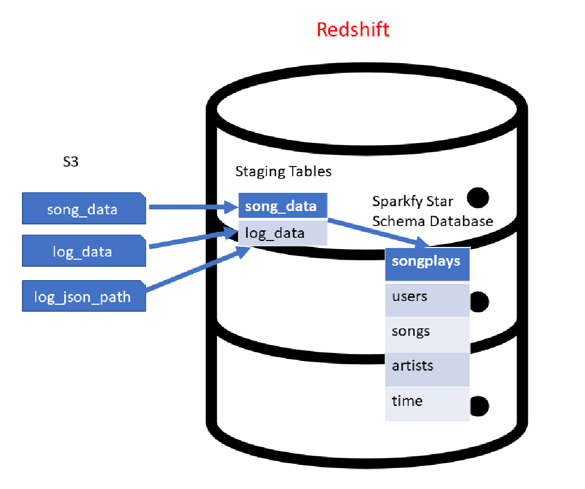
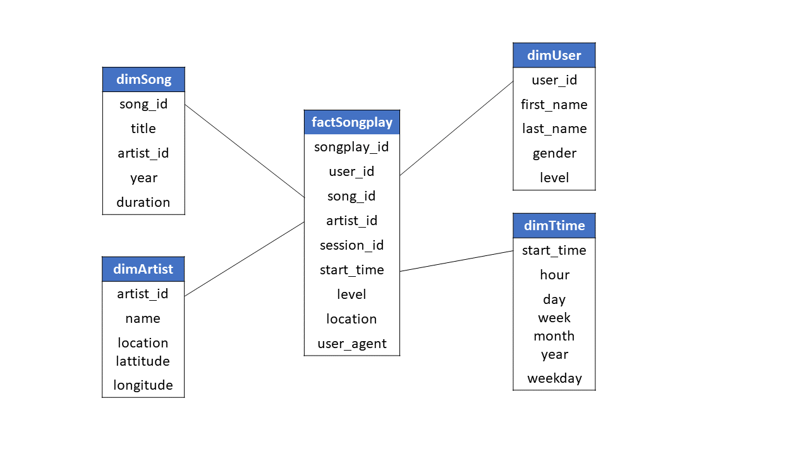

# Sparkify S3 to AWS/Redshift ETL
## ------- A Cloud Data Warehouse Lab Project -------

This lab project builds a data warehouse based on AWS Redshift. A data warehouse is a large store of data collected from a wide range of sources within a company and used to guide management decisions.

The lab exercises an _Extract Transform Load_ (ETL) analytical pipeline for a fictional music streaming startup called _Sparkify_.

The data are extracted from 3 datasets which reside in Amazon S3 before being  transformed and loaded into a Redshift cluster as depicted below.

*Fig.1 - Sparkify S3 to Redshift ETL*

## Project Datasets
The data of the pipeline come from two datasets located in Amazon S3:
- Song Dataset: Contains the songs and some JSON metadata
    - `s3://udacity-dend/song_data`
- Log Dataset: Consists of log files related to the user activities (also in in JSON format).
    - `s3://udacity-dend/log_data`
    - `s3://udacity-dend/log_json_path`.json

## Extract-Transform-Load Pipeline
The setup and operation of the ETL pipeline is controlled by four Python  scripts (`create_cluster.py`,  `create_tables.py`, `etl.py`, `delete_cluster.py`) a Python module (`sql_queries.py`) and a configuration file (`myDWH.cfg`).

During the ETL processing, data is loaded from the above S3 datasets into staging tables of the Redshift cluster. Next, the following an start schema suitable for data analytics is built from SQL statements defined in  `sql_queries.py` and further executed by the srcipt `etl.py`.

*Fig.2 - Start schema*

## How To Run the ETL Pipeline

### STEP-1: AWS access key and secret key
- Add your AWS access key and AWS secret key in the `myDWH.cfg` file or initialize them via the AWS CLI with `aws configure`.

### STEP-2: Create a Redshift cluster on AWS
Note: Before you create a cluster as defined in the setion '[CLUSTER]' of the `myDWH.cfg` file, you may want to specify the AWS region that you want to operate in. 
- Create a new cluster by runninn the command:
    - `python create_cluster.py`.

### STEP-3: Connect to Redshift cluster and create the DB tables 
- Run `python create_tables.py`.

### STEP-4: Connect to Redshift cluster and populate the ETL tables
- Run `python etl.py`.

### STEP-5: Try some queries on the cluster
Open a terminal and connect to the database of the Redshift cluster with the command: 
- `psql -h <CLUSTER_ENDPOINT> -p <CLUSTER_DB_PORT> -U <CLUSTER_DB_USER> -d <CLUSTER_DB_NAME>`
    - Use the connection parameters defined in `myDWH.cfg`.
    - Upon request a password, use the one defined in `myDWH.cfg`. 
- Example:
    - `psql -h dwhcluster.c4p6b3uqdbp8.us-west-2.redshift.amazonaws.com -p 5439 -U dwhuser -d dwh`

### STEP-6: Pause your cluster
During development time, you can send your cluster to a 'PAUSE' state via the AWS / Redshift console. When the cluster is in this state, you won't be charged and you can also restore it quickly agin via the AWS / Redshift console.  

### STEP-7: Delete your Redshift cluster on AWS
- If you no longer need your cluster, you can delete it by runninn the command:
    - `python delete_cluster.py`.

